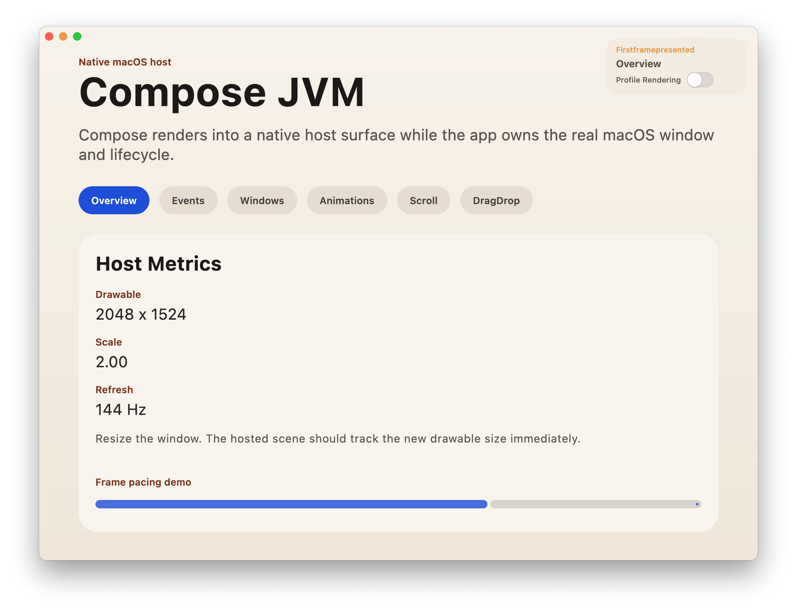

<h1 align="center">Compose Native Host</h1>
<p align="center">Compose in native macOS and Windows windows</p>
<p align="center">
  <a href="https://central.sonatype.com/artifact/io.github.letmutex.compose-native-host/runtime">
    
  </a>
</p>



> [!IMPORTANT]
> This project is experimental. API and features are subject to change.

## Why go native?

- You own the entry point. Compose is just a view in your native window
- Embed Compose view in AppKit, SwiftUI, Win32, or custom native UI
- Smooth scrolling and smooth window resizing on both macOS (Metal) and Windows (D3D12). Sorry AWT
- Built-in GraalVM native image support. Sorry AWT, again
- Multi-window and multi-runtime support
- Android-inspired profile frame rendering
- No code changes needed for existing Compose Desktop content

## Documentation

- [docs/kotlin-runtime-api.md](./docs/kotlin-runtime-api.md): Kotlin runtime API snapshot
- [docs/swift-runtime-api.md](./docs/swift-runtime-api.md): Swift runtime API snapshot
- [docs/windows-support.md](./docs/windows-support.md): Windows support architecture, setup, and compile details
- [gradle-plugin/README.md](./gradle-plugin/README.md): Gradle plugin configuration and task reference

## Minimal SwiftUI Setup

Gradle

```kotlin
// build.gradle.kts
plugins {
    id("io.github.letmutex.compose.nativehost") version "<VERSION>"
    alias(libs.plugins.kotlin.multiplatform)
    alias(libs.plugins.compose.compiler)
    alias(libs.plugins.compose.multiplatform)
}

kotlin {
    jvm("desktop")

    sourceSets {
        val desktopMain by getting {
            dependencies {
                implementation("io.github.letmutex.compose-native-host:runtime:<VERSION>")
                implementation(compose.desktop.currentOs)
            }
        }
    }
}

composeNativeHost {
    appName.set("Sample")
    bundleIdentifier.set("example.sample")
}

// Compose Desktop configs
compose.desktop {
    application {
        mainClass = "example.MainKt"
    }
}
```

Kotlin

```kotlin
// src/desktopMain/kotlin/example/Main.kt
package example

import letmutex.compose.nativehost.ComposeNativeHost

fun main() = ComposeNativeHost {
    App()
}
```

Swift

```swift
// src/macosMain/swift/SwiftUiApp.swift
import SwiftUI
import ComposeNativeHost

final class SampleAppDelegate: ComposeAppDelegateBase {
    fileprivate lazy var runtime = makeComposeRuntime(
        configuration: ComposeRuntimeConfiguration(kotlinMainClass: "example.MainKt")
    )
}

@main
struct SampleApp: App {
    @NSApplicationDelegateAdaptor(SampleAppDelegate.self) private var appDelegate

    var body: some Scene {
        WindowGroup {
            ComposeView(runtime: appDelegate.runtime)
        }
    }
}
```

## Minimal GraalVM Config

Use a GraalVM JDK that already has `native-image` available under `bin/`.

Environment

- Set one of `-PgraalvmHome=/path/to/graalvm`, `GRAALVM_HOME=/path/to/graalvm`, `org.gradle.java.home=/path/to/graalvm`, or `JAVA_HOME=/path/to/graalvm`.
- `macosNativeImageRun` and the native image bundle tasks use that GraalVM home directly.
- Plain `macosRun` still uses a regular JVM launch path.

Gradle

```kotlin
composeNativeHost {
    appName.set("Sample")
    bundleIdentifier.set("example.sample")
    nativeImage {
        mainClasses("example.MainKt")
    }
}
```

Swift startups

```swift
final class SampleAppDelegate: ComposeAppDelegateBase {
    override init() {
        super.init(configuration: ComposeHostConfiguration(startups: [.jvm, .sharedLibrary()]))
    }
}
```

Use `.jvm` so the same host still runs without a bundled shared library, and add `.sharedLibrary()` so the staged native image bundle can bind the generated Graal runtime when present.

## Run App

Use `macosRun` or `windowsRun` for the staged JVM application. On macOS, you can also use `macosNativeImageRun` for the staged native image bundle.

```bash
# macOS JVM run
./gradlew -p samples :appkit:macosRun

# Windows JVM run
./gradlew -p samples :mixed:windowsRun

# macOS native image run
./gradlew -p samples :appkit:macosNativeImageRun
```

## Bundle App

```bash
# build JVM .app / Windows staged bundle
./gradlew -p samples :appkit:macosCreateDistributable
./gradlew -p samples :mixed:windowsCreateDistributable

# package JVM .dmg / Windows MSI
./gradlew -p samples :appkit:macosPackageDmg
./gradlew -p samples :mixed:windowsPackageMsi

# package JVM release .dmg / Windows release MSI
./gradlew -p samples :appkit:macosPackageReleaseDmg
./gradlew -p samples :mixed:windowsPackageReleaseMsi
```

## Modules

- `runtime`: shared host API plus macOS runtime, native bridge, and native host sources.
- `gradle-plugin`: Gradle plugin for macOS launcher generation, bundle staging, and macOS app tasks.
- `samples/compose`: pure Compose Desktop sample app and shared Kotlin sample content.
- `samples/appkit`: AppKit-owned sample window using the shared hosted Kotlin sample.
- `samples/swiftui`: SwiftUI-owned sample window using the shared hosted Kotlin sample.
- `samples/swiftui-min`: minimal SwiftUI-owned sample extracted from the setup shown above.
- `samples/mixed`: AppKit-owned window with SwiftUI content composition around the hosted Compose surface.

## Diagnostics

Debugging environment variables:

- `COMPOSE_NATIVE_HOST_FRAME_TIMINGS=1`: Enable logging of frame timings (dispatch delay, input drain, scene render, etc.) to stdout for performance analysis.
- `COMPOSE_NATIVE_HOST_VSYNC_DELAY=1`: Enable analysis of VSync signal delivery delay from the display link to the Kotlin runtime.

# How it works

### Host (Swift / C++)
You own the native App entry point in **Swift** (macOS) or **C++** (Windows). Your app's native sources (e.g., in `src/macosMain/swift` or `src/windowsMain/cpp`) define the lifecycle, window creation, and message/event loop.

### Runtime (Kotlin, Swift & C++)
*   **Kotlin**: Manages the Compose state, layout, and logic. Uses **Skiko** for Skia rendering bindings.
*   **Swift / C++**: Provides the native host APIs. These native sources are bundled inside the Gradle plugin and extracted during the build to be compiled into your app.

### Bridge (JNI / Obj C / C++)
A thin bridge layer (Objective C on macOS, C++ on Windows) handles low-level JNI communication between the native host and the Kotlin JVM or GraalVM runtime.

### Renderer (Metal / Direct3D 12)
Rendering is performed directly on the **GPU via Metal (macOS) or Direct3D 12 (Windows)**. The custom renderer bypasses AWT/Swing, ensuring smooth synchronization with window resizing and animations.

### Plugin (The Orchestrator)
The Gradle plugin automates the complex **native build pipeline**. It:
1. Extracts internal Swift/C++/Native sources.
2. Compiles native launcher and bridge libraries using `swiftc` (macOS) or MSVC `cl.exe` (Windows).
3. Bundles the native bridge library (`.dylib` / `.dll`) and launcher into the app bundle/folder.
4. Optionally triggers **GraalVM Native Image** (macOS only) for high-performance native binaries.

### Runtime modes
*   **JVM**: Standard Kotlin/JVM JARs are packaged and launched by the native host using a bundled JVM.
*   **Native** (macOS only): Kotlin code is compiled into a standalone shared library via GraalVM, allowing for instant startup and reduced memory overhead.

### Simplified Render Path

```text
+-------------------+          +--------------+          +----------------+          +-------------+
|  Native App Host  | --(1)--> | Bridge Layer | --(2)--> | Kotlin Runtime | --(3)--> | GPU Texture |
| (Swift / C++ Win) |          | (JNI / C-API)|          | (JVM / Native) |          | (Metal/D3D) |
+-------------------+          +--------------+          +----------------+          +-------------+
```

# License

```text
Copyright 2026 letmutex

Licensed under the Apache License, Version 2.0 (the "License");
you may not use this file except in compliance with the License.
You may obtain a copy of the License at

    http://www.apache.org/licenses/LICENSE-2.0

Unless required by applicable law or agreed to in writing, software
distributed under the License is distributed on an "AS IS" BASIS,
WITHOUT WARRANTIES OR CONDITIONS OF ANY KIND, either express or implied.
See the License for the specific language governing permissions and
limitations under the License.
```
